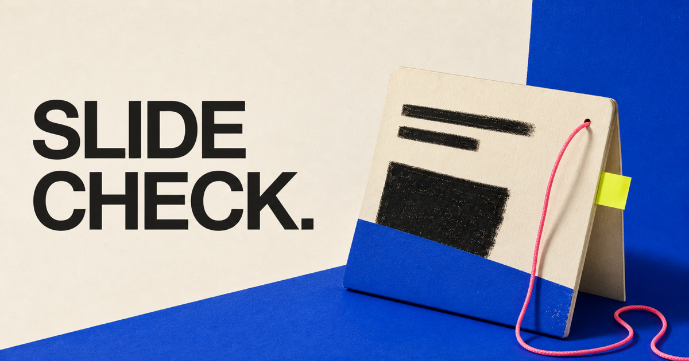
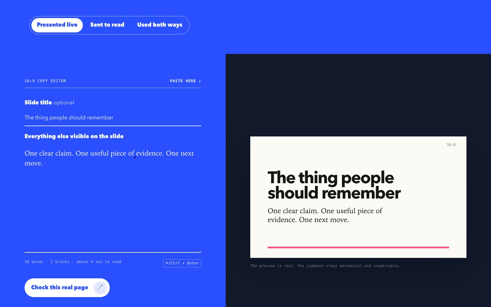

<p align="center">
  
</p>

# Slide Check

**[Open the live tool](https://pitchdog-slide-check.dog-pitch.chatgpt.site)**

**One real slide. One honest call.**

Paste the visible words from a 16:9 slide. Slide Check measures the load it can actually measure, renders the page, then recommends **keep one**, **edit**, or **split**. It does not pretend to judge whether your idea is brilliant.

[](https://github.com/bomkino/pitchdog-slide-check/actions/workflows/ci.yml)

<p align="center">
  
</p>

## Two ways through

- **Quick check:** delivery mode + the exact copy people must read. The smallest useful route.
- **Expert craft check:** an explicit opt-in route with 10 decision groups and more than 55 structured choices covering the page’s job, audience, delivery, visual evidence, timing, source use, and type pressure.

The expert route does not hide a bigger form behind a fancy label. It asks only finite questions the result can use.

## What typing does

Typing is appropriate here because the tool measures the text itself: visible words, blocks, approximate reading load, rendered physical fit, and honest split boundaries. The copy stays in your browser. There is no runtime AI, account, database, analytics, or upload.

It does **not** judge truth, originality, persuasion, taste, or creative quality.

## Run it

Requires Node.js 22.18 or newer.

```bash
npm install
npm run dev
```

Open the local URL Vite prints.

## Verify it

```bash
npm run verify
```

That runs TypeScript checks, product tests, the production build, and hosting-contract tests.

## How it is built

- `src/content.ts` — visible questions and finite expert choices
- `src/analyse.ts` — deterministic editorial decision logic
- `src/measure.ts` — real rendered-fit measurement
- `src/main.ts` — journey, state, result, and 16:9 preview
- `src/ui.ts` / `src/base.css` — shared accessible shell, theme, cursor, and scroll discipline
- `tests/` — route, output, and hosting contracts
- `docs/PRODUCT-CONTRACT.md` — what the tool promises and refuses to fake

## Contributing and reuse

Read [CONTRIBUTING.md](CONTRIBUTING.md), [CODE_OF_CONDUCT.md](CODE_OF_CONDUCT.md), and [SECURITY.md](SECURITY.md).

Software and documentation: [AGPL-3.0-or-later](LICENSE). Original visual assets: [CC BY-SA 4.0](ASSET-LICENSE.md). The pitch.dog name and logo remain subject to [TRADEMARKS.md](TRADEMARKS.md).
